# Pràctica final Entorns: Say Big Numbers

## Configuración de webapp
### Configurar Tomcat local:

### Configurar archivo WAR en Tomcat Servidor
Mover archivo .war de local al servidor con scp:
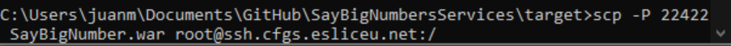

Conexión ssh al servidor:
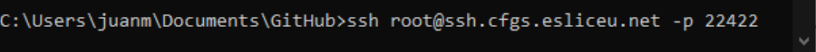

Mover a la ruta webapps de tomcat:
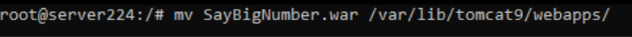

Entrar vía web al tomcat del servidor:
[Link Servidor Tomcat](http://tomcat224.cfgs.esliceu.net:8080/manager/html)

Otra opción para subir y desplegar el archivo .war manualmente, es en el apartado “manager” de tomcat:
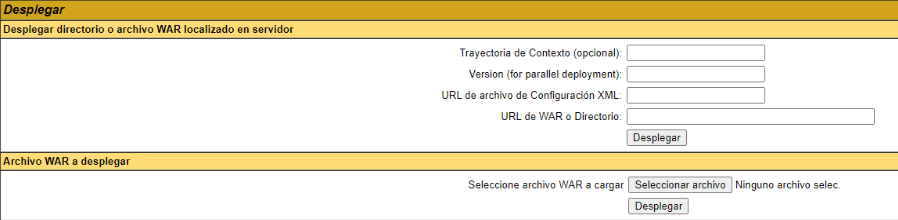

Una vez desplegado, lo encontraremos en la lista de Rutas de aplicaciones.
Al subir un nuevo archivo de proyecto .war se genera automáticamente un directorio con el mismo nombre, en él podemos encontrar todo lo necesario para ejecutar la aplicación web.
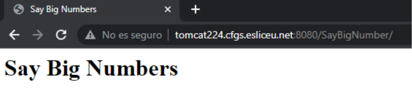

Al Ejecutar la aplicación encontramos nuestro proyecto:
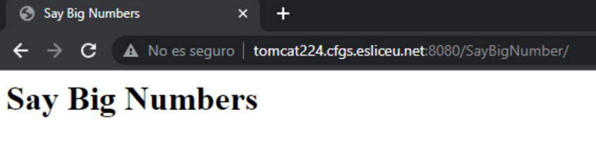

## PIPELINE
### CREAR PROYECTO en GIT
- Creamos un nuevo repositorio en github.com.
- Abrimos la Terminal en nuestro Sistema.
- Navegamos hasta la ruta raíz donde deseamos instalar el repositorio local.
- En nuestro nuevo repositorio en GitHub, obtenemos la URL “https” de clonación.
- En la terminal ejecutamos el comando “git clone {URL}”, al ejecutar el comando ya tenemos el repositorio remoto en Local para así trabajar con él.
- Para asegurarnos que funciona, desde la terminal, creamos un nuevo archivo, por ejemplo “README.md”, lo agregamos al área de preparación con el comando “git add {NOMBRE_ARCHIVO}”, confirmamos los cambios con “git commit -m {MENSAJE}” y sincronizamos con el repositorio remoto con el comando “git push origin main”.
- El archivo ya está disponible en nuestro repositorio de GitHub.

### UNIT TESTS
Hacer pruebas unitarias en nuestra aplicación Java para que nos permita detectar y corregir errores de manera temprana, garantizando la calidad del código y mejorando la confiabilidad y robustez de nuestra aplicación.
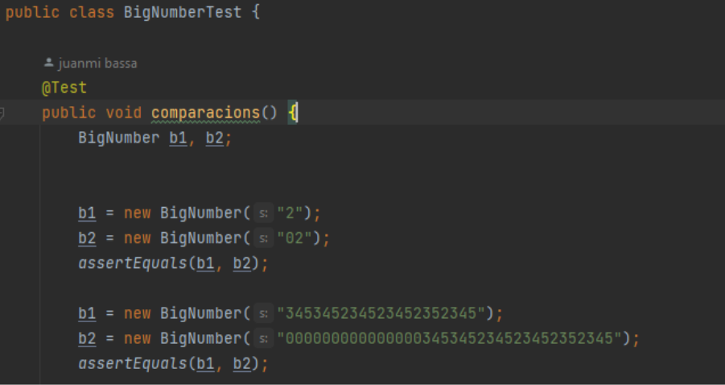

### DESARROLLO DE CÓDIGO
Programar la aplicación Java es con base a nuestros Tests Unitarios y las especificaciones pedidas.
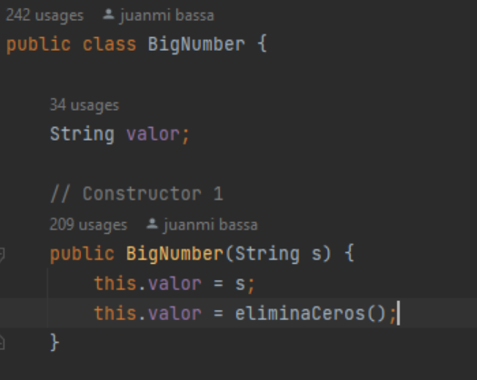

### MAVEN
**¿Qué es?:** Maven es una herramienta de gestión de proyectos de software ampliamente utilizada en el desarrollo de aplicaciones Java. Su principal objetivo es ayudar a los desarrolladores a gestionar y organizar las dependencias de su proyecto, así como automatizar tareas comunes relacionadas con la construcción, el empaquetado y la documentación del proyecto.

**Configurar Maven:** El primer paso es instalar Maven en nuestro sistema Local. Una vez instalado podemos configurar Maven con nuestro proyecto, esto se hace creando un archivo YAML en la raíz del proyecto llamado "pom.xml".

En él se incluye información sobre el nombre del proyecto, su versión, los desarrolladores involucrados y las bibliotecas o frameworks que se utilizan.
Tal que así:
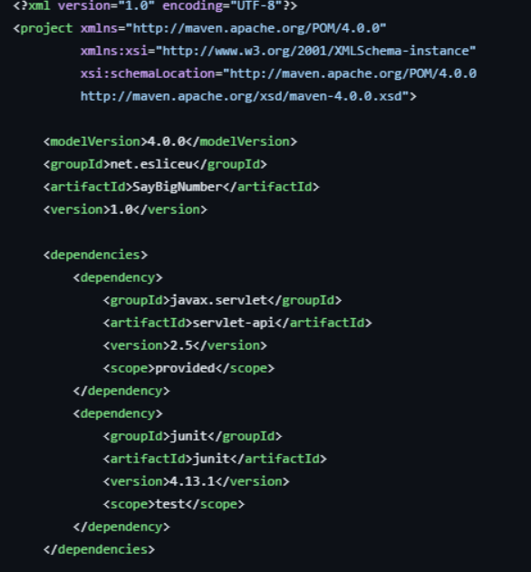

Una vez configurado el archivo correctamente, nuestro proyecto ya se podrá construir y administrar con los comandos que maven nos proporciona, como por ejemplo  “mvn clean”, “mvn compile” o “mvn package”.

### SONARCLOUD
**¿Qué es?:** SonarCloud es una plataforma en línea proporcionada por SonarSource que ofrece análisis estático de código y evaluaciones de calidad para proyectos de desarrollo de software. Ayuda a identificar y corregir problemas de calidad del código, detectar vulnerabilidades de seguridad y mejorar la eficiencia y mantenibilidad del software.

**Vincular un nuevo Proyecto en SonarCloud web:** Creamos una nueva organización en sonarcloud.io para el proyecto y vinculamos el repositorio remoto de GitHub a la nueva organización, en nuestro caso será “SayBigNumbersServices”.
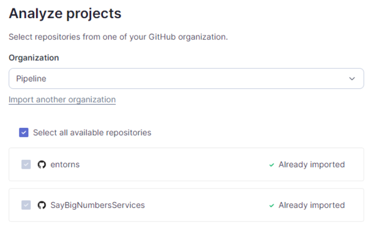

Y ya tendremos la conexión entre SonarCloud y nuestro repositorio de GitHub.
**Aquí podemos ver el resultado:**
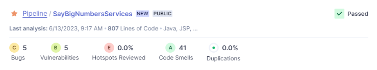

### CONFIGURAR GITHUB ACTIONS
#### Conexión github + WAR:
**¿Qué es?:** Un archivo WAR (Web Application Archive) es un formato de archivo utilizado para empaquetar y distribuir aplicaciones web desarrolladas en el lenguaje de programación Java. Este formato es comúnmente utilizado en entornos de desarrollo web basados en la plataforma Java, como Apache Tomcat, JBoss, WebSphere, entre otros.

Cuando se despliega un archivo WAR en un servidor web, el servidor extrae el contenido del archivo y lo configura para que la aplicación web sea accesible a través de una URL específica.

**Generar el archivo War:** Para ello, la forma más común es utilizando la Terminal, posicionándonos en el directorio raíz del proyecto y ejecutando el comando “mvn clean package”.

Nosotros utilizaremos y configuraremos un workflow en GitHub Actions para que el archivo .war sea generado automáticamente en cada cambio y subida al repositorio remoto:

Para ello, creamos un archivo YAML, normalmente llamado “main.yml” o “build.yml”, dentro del directorio “.github/workflows”.
En el interior del archivo configuramos la llamada al Workflow:
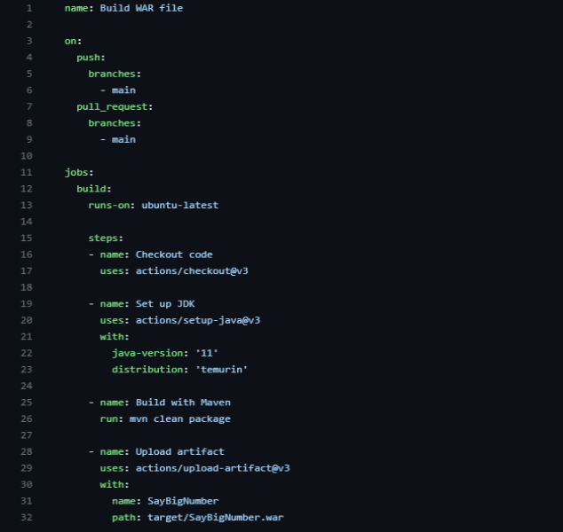
En esta configuración podemos ver que ejecutará el comando “mvn clean package” al realizar un push o pull del proyecto y creará un artefacto con el archivo .war.

**Aquí podemos ver el resultado:**
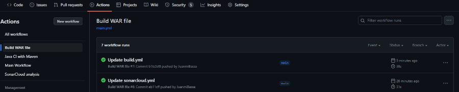
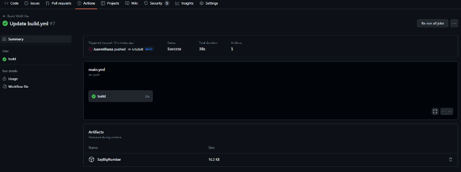

#### Conexión github + Maven:

#### Conexión github + SonarCloud:
Una vez tengamos configurado el proyecto en SonarCloud web, para su vinculación con GitHub Actions debemos entrar en nuestro proyecto en “SonarCloud > administration > Analysis Method”, en este apartado encontraremos la opción de Analizar el proyecto con GitHub Action .
Una vez dentro, podemos observar una serie de pasos a seguir para realizar la conexión:
1 Inhabilitar el análisis automático.
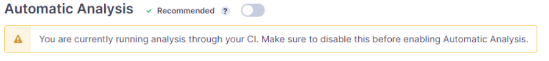

2 Crear un Actions Secret en GitHub con los datos proporcionados. Este archivo se crea desde los ajustes de nuestro proyecto en GitHub.
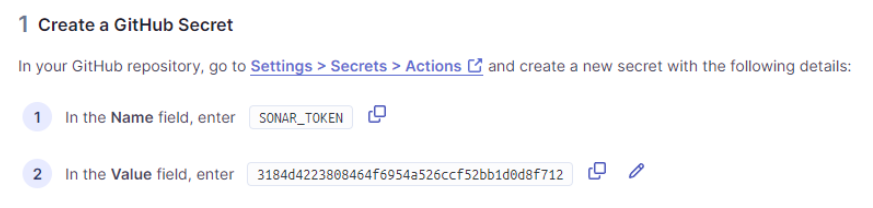
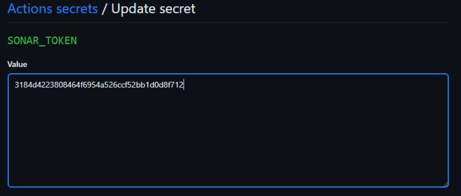

3 Ya que nuestro proyecto utiliza Maven, seleccionamos esa opción y añadimos las siguientes líneas en el apartado “properties” de nuestro archivo pom.yml:
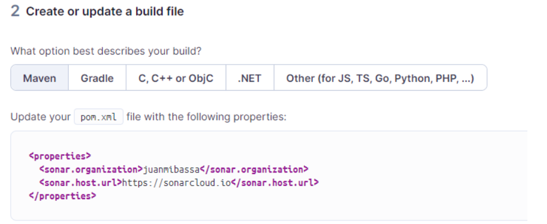

4 Creamos un archivo YAML llamado “build.yml” en nuestro directorio “.github/workflows/” con el código proporcionado:
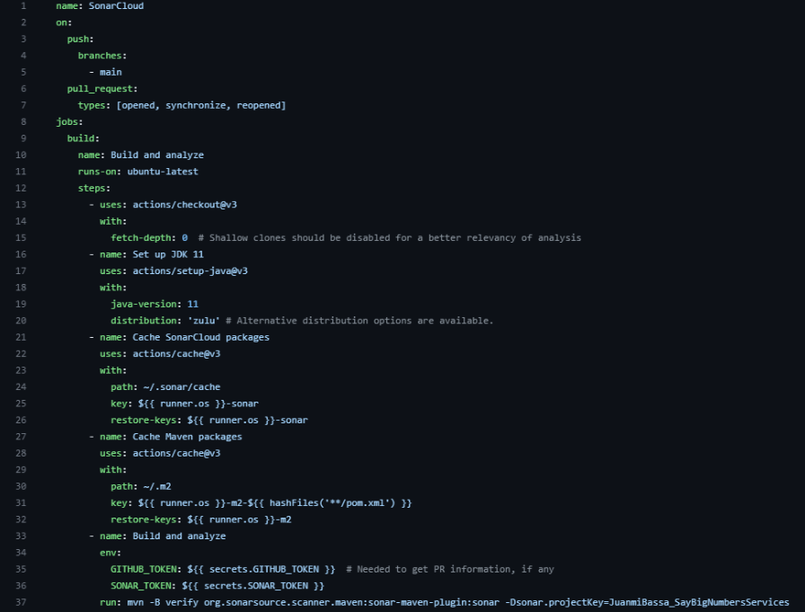

Una vez realizados todos los pasos anteriores correctamente, al realizar un nuevo cambio en el proyecto, el GitHub Actions de SonarCloud se ejecutará automáticamente:
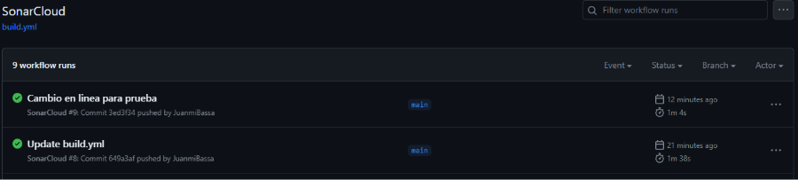

Si entramos en la información de la ejecución, veremos todos los pasos realizados, nuestro Análisis se puede encontrar en el paso “Build and analyze”, en una de las líneas llamada “[INFO] ANALYSIS SUCCESSFUL <link del análisis en SonarCloud>, apretando a ese link nos llevaría al análisis en la Web de SonarCloud.

**También podemos ver el análisis de SonarCloud desde github:**
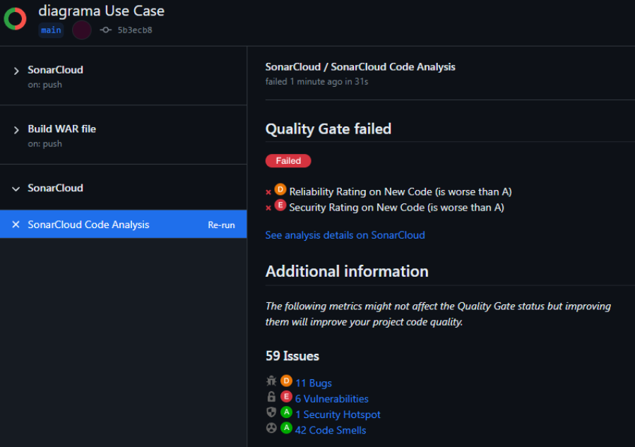

### API TEST con Postman
Postman es una herramienta de colaboración y desarrollo de API que permite a los desarrolladores probar, documentar y realizar solicitudes a API de manera eficiente. Es una aplicación que se ejecuta en el escritorio y brinda una interfaz gráfica de usuario para enviar solicitudes HTTP y HTTPS a diferentes endpoints de API.

Una vez tenemos la URL de nuestro Servidor de Despliegue de pruebas, podemos hacer el siguiente test, el cual devolverá 200 si la respuesta ha sido exitosa, lo que significa que hay conexión:
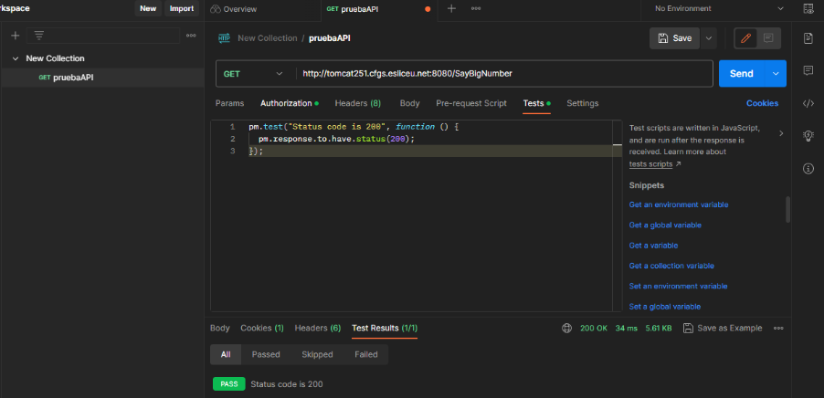

### E2E TEST con Cypress

### CONFIGURAR GITHUB ACTIONS
##### Conexión de github + Postman (API):

##### Conexión de github + Cypress (e2e):

### DESPLIEGUE

