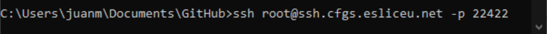
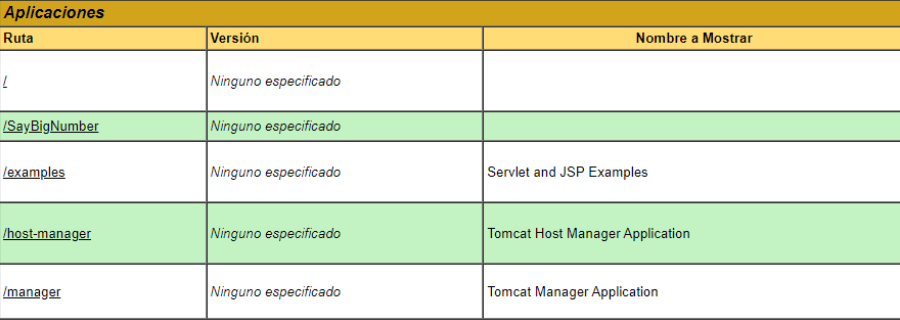

# Pràctica final Entorns: Say Big Numbers

## Configuración de webapp
### Configurar Tomcat local:

### Configurar archivo WAR en Tomcat Servidor

Mover archivo .war de local al servidor con scp:

Conexión ssh al servidor:

Mover a la ruta webapps de tomcat:

Entrar vía web al tomcat del servidor:
http://tomcat224.cfgs.esliceu.net:8080/manager/html

Otra opción para subir y desplegar el archivo .war manualmente, es en el apartado “manager” de tomcat:

Una vez desplegado, lo encontraremos en la lista de Rutas de aplicaciones.
Al subir un nuevo archivo de proyecto .war se genera automáticamente un directorio con el mismo nombre, en él podemos encontrar todo lo necesario para ejecutar la aplicación web.

Al Ejecutar la aplicación encontramos nuestro proyecto:

