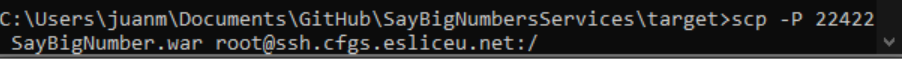

# Pràctica final Entorns: Say Big Numbers

## Configuración de webapp
### Configurar Tomcat local:

### Configurar archivo WAR en Tomcat Servidor
Mover archivo .war de local al servidor con scp:

Conexión ssh al servidor:

Mover a la ruta webapps de tomcat:

Entrar vía web al tomcat del servidor:
[Link Servidor Tomcat](http://tomcat224.cfgs.esliceu.net:8080/manager/html)

Otra opción para subir y desplegar el archivo .war manualmente, es en el apartado “manager” de tomcat:

Una vez desplegado, lo encontraremos en la lista de Rutas de aplicaciones.
Al subir un nuevo archivo de proyecto .war se genera automáticamente un directorio con el mismo nombre, en él podemos encontrar todo lo necesario para ejecutar la aplicación web.

Al Ejecutar la aplicación encontramos nuestro proyecto:

## PIPELINE
#### CREAR PROYECTO en GIT
- Creamos un nuevo repositorio en github.com.
- Abrimos la Terminal en nuestro Sistema.
- Navegamos hasta la ruta raíz donde deseamos instalar el repositorio local.
- En nuestro nuevo repositorio en GitHub, obtenemos la URL “https” de clonación.
- En la terminal ejecutamos el comando “git clone {URL}”, al ejecutar el comando ya tenemos el repositorio remoto en Local para así trabajar con él.
- Para asegurarnos que funciona, desde la terminal, creamos un nuevo archivo, por ejemplo “README.md”, lo agregamos al área de preparación con el comando “git add {NOMBRE_ARCHIVO}”, confirmamos los cambios con “git commit -m {MENSAJE}” y sincronizamos con el repositorio remoto con el comando “git push origin main”.
- El archivo ya está disponible en nuestro repositorio de GitHub.

#### UNIT TESTS
Hacer pruebas unitarias en nuestra aplicación Java para que nos permita detectar y corregir errores de manera temprana, garantizando la calidad del código y mejorando la confiabilidad y robustez de nuestra aplicación.

#### DESARROLLO DE CÓDIGO
Programar la aplicación Java es con base a nuestros Tests Unitarios y las especificaciones pedidas.

